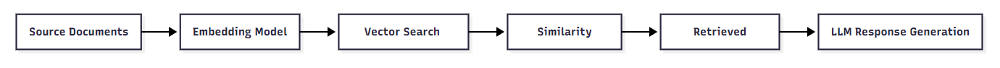
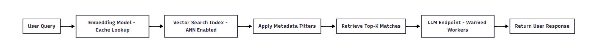
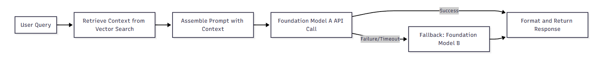

# Chapter 5. Deploying and Integrating RAG Systems on Databricks

Deploying and integrating retrieval-augmented generation (RAG) systems on Databricks bridges the gap between experimentation and production-ready AI solutions. While earlier chapters have focused on building, refining, and validating individual components such as embeddings, vector search, and prompt pipelines, this chapter focuses on assembling these parts into a complete, reliable, and scalable system. This is where your work moves from the notebook to the endpoint, enabling consistent and secure access for downstream applications.

From a certification perspective, mastering deployment on Databricks is essential. The Databricks Certified Generative AI Associate exam expects you to not only understand RAG concepts but also demonstrate the ability to operationalize them using Databricks-native tools. This means being fluent in MLflow tracking and model registration, creating vector indexes, deploying to model serving endpoints, and ensuring performance and cost efficiency. A well-deployed RAG system ensures that your AI applications deliver relevant, timely responses while maintaining governance and scalability.

For someone new to production deployment, the concept can seem daunting—different tools, configuration layers, and performance considerations all come into play. This chapter breaks down those complexities into a practical workflow you can follow. We’ll walk through chain assembly and testing, deployment steps, endpoint optimization, and advanced serving patterns. Along the way, you’ll see how to connect Databricks with frameworks like LangChain, and how to ensure your RAG pipeline is ready for real-world demands.

Whether you are preparing for the exam or deploying your first enterprise-grade AI assistant, this chapter is designed to give you the structure, techniques, and confidence to move your RAG system into production.

# Learning Objectives

By the end of this chapter, you will be able to do the following:

  * Assemble complete RAG chains using LangChain and Databricks Pyfunc models.

  * Deploy models to Databricks Model Serving endpoints with proper versioning and access controls.

  * Implement vector search indexes and integrate them into deployed RAG pipelines.

  * Optimize endpoint performance for latency, throughput, and cost efficiency.

  * Apply advanced pre- and post-processing patterns to enhance RAG system accuracy.

# Prerequisites

Before starting this chapter, you should:

  * Understand the basic concepts of RAG and its components (embeddings, vector stores, LLM chains).

  * Have hands-on experience with Databricks notebooks and MLflow basics.

  * Be familiar with LangChain fundamentals and its chain abstractions

  * Know how to create and query Delta tables in Databricks.

  * Possess basic Python programming skills, including working with virtual environments and installing packages.

# Chain Assembly and Testing

Assembling and testing the chain is the first step in transitioning a RAG prototype into a deployable solution. A _chain_ here refers to the sequence of components that work together to retrieve relevant documents, augment a prompt with those documents, and generate a model response. In Databricks, this typically combines vector search, a large language model (LLM), and glue code—often implemented with LangChain—that orchestrates the data flow between these components.

Chain assembly matters because every downstream deployment depends on the correctness and reliability of this logic. A poorly assembled chain can produce irrelevant results, degrade user trust, and increase operational costs. For example, imagine a customer-support assistant that answers questions from a Delta table of product manuals: the chain retrieves the top 5 passages from a Databricks Vector Search index—a managed vector database that stores embeddings and supports similarity search with low‑latency, scalable indexes—formats them into a prompt, calls an LLM, and returns a grounded answer with source citations. If the retriever is misconfigured (for example, wrong embedding model or too-small `k`), the LLM hallucinates; if the prompt template omits citations, the response becomes unverifiable. In this section, you will assemble that exact flow as a Pyfunc model (so it can be versioned and served), see how to wrap a LangChain pipeline into a servable model, and choose when to run locally for debugging versus hosting on Databricks Model Serving for production.

## Pyfunc Model Structure

A Pyfunc model in Databricks is a Python function-based model format supported by MLflow. Pyfunc models allow you to package arbitrary Python code, including LangChain logic, into a reusable and deployable format. This flexibility makes Pyfunc a key building block for RAG system deployment. At a high level, a Pyfunc model includes the following:

Artifacts
    

Serialized files that capture the state or resources your model needs to function consistently in deployment. These can include vector store indexes for fast retrieval, tokenizer configurations that ensure consistent text processing, or prompt templates that structure queries to the LLM. For example, if your RAG pipeline uses a FAISS vector index trained on a product knowledge base, that index file becomes an artifact; likewise, a JSON file defining how prompts are constructed from retrieved passages would also be stored as an artifact. Artifacts make your model self-contained, so that when it is loaded in a new environment, it has all the necessary components to operate correctly.

Conda or environment specification
    

A definition of all the dependencies, package versions, and sometimes system libraries that the model requires to run consistently in any environment. This typically lives in a _conda.yaml_ or _requirements.txt_ file and may list packages such as `langchain==0.1.12`, `pandas`, and `mlflow`. By pinning versions, you prevent incompatibility issues—for example, ensuring the same embedding library version is used both during development and after deployment on Databricks Model Serving. Without an accurate environment specification, the model could fail at runtime due to missing packages or version mismatches.

`python_function` flavor
    

The MLflow flavor that designates the Python-based entry point for your model. It defines the implementation of the `predict()` method, which is the central function that receives input data, applies any retrieval logic, constructs prompts, invokes the LLM, and returns results. In the context of a RAG pipeline, `predict()` might accept a dictionary with a user query, run a vector search, build a prompt using retrieved documents, and then call the model to produce the answer. Always log a model signature when saving so the serving layer can validate incoming request schemas and reject malformed inputs before they reach the chain.

###### Note

Even though MLflow supports multiple flavors (for example, `sklearn`, `pytorch`), using `python_function` is ideal for RAG systems because it allows custom logic that spans retrieval, prompt augmentation, and LLM invocation. [Figure 5-1](https://learning.oreilly.com/library/view/databricks-certified-generative/9798341623446/ch05.html#ch05_figure_1_1759351410907222) shows the Pyfunc model structure.

###### Figure 5-1. Pyfunc model structure

The diagram shows how artifacts and environment specifications feed into the `predict()` method, which orchestrates retrieval and generation before returning the final response. [Example 5-1](https://learning.oreilly.com/library/view/databricks-certified-generative/9798341623446/ch05.html#ch05_example_1_1759351410916357) is a minimal Pyfunc wrapper for a LngChain RAG pipeline.

##### Example 5-1. Minimal Pyfunc Wrapper for a LangChain RAG Pipeline
    
    
    import mlflow.pyfunc
    
    class RAGModelWrapper(mlflow.pyfunc.PythonModel):
        def load_context(self, context):
            import langchain
            self.chain = load_langchain_pipeline(context.artifacts["rag_config"])
        
        def predict(self, context, model_input):
            return self.chain.run(model_input["query"])
    
    mlflow.pyfunc.save_model(
        path="rag_pyfunc_model",
        python_model=RAGModelWrapper(),
        artifacts={"rag_config": "/dbfs/path/to/rag_config.json"},
        conda_env="conda.yaml"
    )

This example wraps a LangChain RAG pipeline into a Pyfunc model that can be registered and deployed in Databricks.

## LangChain Chain to Serveable Model

LangChain provides high-level abstractions for chaining together LLM calls, document retrieval steps, and any additional custom logic required for your application. These abstractions hide much of the boilerplate—such as managing API calls or orchestrating multiple components—so you can focus on defining the flow of data and transformations. In practice, a LangChain chain might connect a Databricks Vector Search retriever to a prompt template and an LLM endpoint, returning a grounded answer with citations. Converting such a LangChain chain into a servable model means packaging all of these components and their configuration into a portable, reproducible form that can be deployed to Model Serving or run locally. This conversion process typically involves the following steps:

  1. _Finalizing your chain configuration (prompt templates, retriever settings, LLM parameters):_ This means locking in the exact structure of your RAG pipeline before packaging it. For example, decide on the prompt wording, the top-k value for your retriever, and the temperature setting for your LLM so that results are reproducible.

  2. _Encapsulating the chain in a_ _Pyfunc_ _mode:_ As shown earlier, this step wraps the configured chain in a Python class that implements the MLflow `python_function` flavor. Doing this allows the retrieval, augmentation, and generation logic to run inside a standardized `predict()` method, ensuring it can be deployed and called like any other MLflow model.

  3. _Saving and registering the model with_ _MLflow_ _:_ Here, you persist the Pyfunc model to storage and register it in the MLflow Model Registry. This makes the model version-controlled, discoverable, and ready for deployment to Databricks Model Serving or any other compatible environment.

###### Tip

Use LangChain’s `Runnable` interface when possible—it standardizes the `invoke()` method, making integration into Pyfunc models more straightforward.

## Local vs. Hosted Deployment Paths

Once you have a servable Pyfunc model packaged and ready, the next decision is how to deploy it to serve predictions. Broadly, you can run it in a _local environment_ —such as on your development machine or a sandbox cluster—for quick iteration and debugging, or in a _hosted environment_ like Databricks Model Serving for production-grade availability, scaling, and integration. Local deployment offers speed and control during development, while hosted deployment ensures reliability, governance, and performance in real-world usage. [Table 5-1](https://learning.oreilly.com/library/view/databricks-certified-generative/9798341623446/ch05.html#ch05_table_1_1759351410911752) compares the two approaches.

Table 5-1. Comparison of Local vs Hosted Deployment PathsCriteria| Local Deployment| Hosted Deployment (Databricks Model Serving)  
---|---|---  
**Use Case** | Development, debugging, and small-scale testing| Production workloads, scaling, integration with external apps  
**Performance** | Dependent on local resources| Auto-scaled and optimized by Databricks  
**Cost** | Low (local hardware)| Pay-per-compute usage  
**Security** | Local network control| Built-in access control, audit logging  
**Ease of Integration** | Limited to local endpoints| Accessible via REST API, integrates with enterprise systems  
  
Choosing between these depends on your stage in the deployment lifecycle. Development typically starts local, but production demands push toward hosted, scalable endpoints.

At this point, you’ve structured your RAG chain into a servable Pyfunc model and understood your deployment options. In the next section, we’ll focus on the _model deployment process_ —tracking, registering, and serving your model for real-world usage.

# Model Deployment Process

Consider a warranty Q&A assistant used by both customer service representatives and the self-service portal. You experiment with retrieval parameters such as top‑k and LLM temperature to ensure answers are grounded and consistent. Once you identify the best configuration, you track the winning run, register the resulting Pyfunc model, and promote a specific version to Production so the assistant can be served from a single, stable endpoint consumed by both internal workflows and external clients. This scenario illustrates the typical path from experimentation to governed, versioned deployment in Databricks.

Deploying a RAG chain on Databricks requires a predictable path from experimentation to a governed, versioned, and callable endpoint. This section explains how you track and register models with MLflow, how you deploy those models to Databricks Model Serving, and how you manage access and version control so downstream applications call the intended, approved version every time. You will see a pragmatic flow that aligns to the exam blueprint and is repeatable in enterprise environments.

A successful deployment hinges on three practices: capturing lineage with MLflow Tracking, promoting models through the MLflow Model Registry, and exposing the approved version through Model Serving with the right permissions. You will implement each practice with working examples and guardrails that reduce operational risk.

## MLflow Tracking and Registration

In Databricks, MLflow Tracking is the mechanism for capturing the full context of each experiment run—logging parameters like retrieval top‑k, metrics such as exact match or latency, artifacts including your vector index and prompt templates, and the code version used. Capturing this information ensures you can re‑create the same conditions that produced a given model. Once a model is saved, the MLflow Model Registry lets you transform it into a governed asset with explicit versions and lifecycle stages (for example, _Staging_ for testing in controlled environments and _Production_ for serving to end users). Let’s understand it with an example where we will fully register the Pyfunc RAG model that is versioned, auditable, and ready to be promoted to the next stage of deployment. [Figure 5-2](https://learning.oreilly.com/library/view/databricks-certified-generative/9798341623446/ch05.html#ch05_figure_2_1759351410907253) shows how an experiment produces a saved Pyfunc model, which is then registered and promoted through stages before serving.

###### Figure 5-2. MLflow lifecycle for a RAG model

[Example 5-2](https://learning.oreilly.com/library/view/databricks-certified-generative/9798341623446/ch05.html#ch05_example_2_1759351410916385) tracks a RAG training/evaluation run and saves a Pyfunc model.

##### Example 5-2. Track a RAG training/evaluation run and save a Pyfunc model
    
    
    import mlflow
    import mlflow.pyfunc
    from mlflow.models.signature import infer_signature
    import pandas as pd
    
    class RAGModel(mlflow.pyfunc.PythonModel):
        def load_context(self, context):
            self.cfg = context.artifacts["rag_config"]
            self.index = context.artifacts["vector_index"]
            self.chain = build_chain(self.cfg, self.index)
        def predict(self, context, model_input):
            if isinstance(model_input, pd.DataFrame):
                qs = model_input["query"].tolist()
            else:
                qs = [model_input["query"]]
            return pd.DataFrame({"response": [self.chain.invoke({"query": q}) for q in qs]})
    
    with mlflow.start_run() as run:
        # Log params/metrics you care about for auditability
        mlflow.log_param("retriever.top_k", 5)
        mlflow.log_param("llm.temperature", 0.1)
        mlflow.log_metric("val_exact_match", 0.63)
    
        # Save model with signature and artifacts
        sample_in = pd.DataFrame({"query": ["Where is the warranty info?"]})
        sample_out = pd.DataFrame({"response": ["..."]})
        sig = infer_signature(sample_in, sample_out)
    
        mlflow.pyfunc.save_model(
            path="rag_pyfunc_model",
            python_model=RAGModel(),
            signature=sig,
            artifacts={
                "rag_config": "/dbfs/path/to/rag_config.json",
                "vector_index": "/dbfs/path/to/index.faiss"
            },
            conda_env="conda.yaml",
        )

[Example 5-2](https://learning.oreilly.com/library/view/databricks-certified-generative/9798341623446/ch05.html#ch05_example_2_1759351410916385) creates a traceable run with parameters and metrics, and saves a self-contained Pyfunc model with a model signature. [Example 5-3](https://learning.oreilly.com/library/view/databricks-certified-generative/9798341623446/ch05.html#ch05_example_3_1759351410916404) registers the saved model to the MLflow Model Registry.

##### Example 5-3. Register saved model to MLflow Model Registry
    
    
    import mlflow
    from mlflow import register_model
    
    model_uri = "runs:/" + mlflow.last_active_run().info.run_id + "/rag_pyfunc_model"
    result = register_model(model_uri=model_uri, name="rag_assistant")
    print("Registered version:", result.version)

Registering the model in the MLflow Model Registry makes it visible to all authorized users, assigns it a unique version number for tracking changes over time, and allows it to move through defined lifecycle stages such as Staging and Production. This process not only ensures discoverability but also enforces governance, making the model eligible for controlled stage transitions.

###### Tip

Use consistent, lowercase names for models (for example, `rag_assistant`) and avoid spaces; this simplifies automation and REST calls.

## Deploying to Model Serving Endpoints

After registration, the next step is to make the model available for consumption by downstream systems. This is done by exposing it through a managed, autoscaled REST endpoint provided by Databricks Model Serving. In practice, a serving endpoint is configured to attach directly to a specific model name combined with either a version number or a stage designation (such as Staging or Production). In most enterprise workflows, the endpoint is pointed at the Production stage so that all calling applications and services automatically receive responses from the most recent, fully approved model version without needing to change their integration code. [Figure 5-3](https://learning.oreilly.com/library/view/databricks-certified-generative/9798341623446/ch05.html#ch05_figure_3_1759351410907271) shows a Production-stage model feeding a single endpoint used by multiple clients.

###### Figure 5-3. Serving an approved model version

[Example 5-7](https://learning.oreilly.com/library/view/databricks-certified-generative/9798341623446/ch05.html#ch05_example_7_1759351410916465) promotes and serves a specific model version.

##### Example 5-4. Promote and serve a specific model version
    
    
    # Promote version to Production
    from mlflow.tracking import MlflowClient
    client = MlflowClient()
    client.transition_model_version_stage(
        name="rag_assistant", version="3", stage="Production", archive_existing_versions=True
    )
    
    # (Optionally) create or update a serving endpoint using Databricks SDK or REST
    # Pseudocode outline; refer to your workspace SDK for exact call
    # databricks.serving.create_or_update_endpoint(
    #     name="rag-assistant-endpoint",
    #     served_models=[{"model_name": "rag_assistant", "model_version": "3"}],
    #     scale_to_zero=True
    # )

This deployment pattern involves promoting a specific model version to the Production stage and configuring a single, consistent endpoint to serve it. By doing so, all client applications access the model through a stable URL, while you retain full control to upgrade, rollback, or swap out the underlying model version transparently. This separation between the client-facing endpoint and backend version management allows you to evolve the model without requiring any changes to client integrations.

###### Note

You can point an endpoint at a _stage_ (for example, Production) rather than a fixed version. This lets you roll forward quickly by changing the stage assignment without modifying the endpoint configuration.

## Access and Version Control

Security and governance processes are critical for protecting your model serving environment. They ensure that only explicitly authorized users or systems can invoke the endpoint, and that every request is traceable so you can identify exactly which model version generated each response. To enforce this, you manage permissions at two distinct levels: in the Model Registry, where you control who can transition models between lifecycle stages, and at the serving endpoint, where you define who can send queries. In addition, well‑defined version control policies—such as stage‑based promotion rules or explicit version pinning—help you orchestrate coordinated rollouts and safe rollbacks, minimizing the risk of unintended model changes in production. [Table 5-2](https://learning.oreilly.com/library/view/databricks-certified-generative/9798341623446/ch05.html#ch05_table_2_1759351410911779) summarizes the governance responsibilities for each role in the enterprise.

Table 5-2. Typical responsibilities for model governanceRole| Registry Permissions| Endpoint Permissions| Responsibility  
---|---|---|---  
MLOps Engineer| Transition versions, manage webhooks| Manage endpoint configs| Promote/rollback versions, configure scaling  
Data Scientist| Create runs, register models| Read-only access| Improve quality, propose candidates  
App Team| None| Query endpoint| Integrate responses into applications  
Security Admin| Manage ACLs| Manage ACLs| Enforce RBAC, audit access  
  
Before you grant access, decide whether the endpoint will follow a _stage-based_ or _version-based_ policy, and understand the trade-offs of each. In a stage-based policy, you promote models between lifecycle stages (for example, from Staging to Production) and point the endpoint at a stage rather than a fixed version; this simplifies promotion workflows, allows quick roll-forwards or rollbacks, and keeps client integrations unchanged. In a version-based policy, you configure the endpoint to use a specific, immutable model version; this approach provides explicit pinning, which is critical when you need to freeze behavior for compliance, regulatory, or contractual obligations, or to protect critical clients from untested changes.

[Example 5-8](https://learning.oreilly.com/library/view/databricks-certified-generative/9798341623446/ch05.html#ch05_example_8_1759351410916480) enforces stage-based promotion with auditability.

##### Example 5-5. Enforce stage-based promotion with auditability
    
    
    from mlflow.tracking import MlflowClient
    client = MlflowClient()
    
    # Allow only MLOps group to promote to Production
    # (Configured in workspace permissions UI or via REST)
    
    # Log an approval note when promoting
    client.set_model_version_tag(
        name="rag_assistant", version="4", key="approval_ticket", value="CHG-2187"
    )
    client.transition_model_version_stage(
        name="rag_assistant", version="4", stage="Production", archive_existing_versions=True
    )

The tag captures the unique change or approval ticket ID (for example, a Jira or ServiceNow reference) associated with the promotion event. This creates a permanent audit trail that links the model version change to an authorized change request, improving traceability and compliance. Importantly, this process does not require altering the endpoint URL, so all client integrations remain uninterrupted while governance requirements are met.

###### Warning

Avoid untracked hotfixes to endpoint code. Always package changes into a new model version and promote through the registry so you preserve reproducibility and rollback paths.

With a governed, versioned endpoint in place, you have a reliable contract for clients and a repeatable path for improvements. The next section addresses _vector search and endpoint_ _optimization_ so the endpoint remains both fast and cost-efficient under realistic load.

# Vector Search and Endpoint Optimization

As RAG applications mature in Databricks, the performance and reliability of vector search become as important as the quality of your LLM itself. A well-designed vector search pipeline ensures that relevant, context-rich documents are retrieved quickly and efficiently for every query, reducing latency and improving the grounding of generated responses. Similarly, optimizing your serving endpoint directly affects cost, user experience, and scalability under real-world load.

In this section, we will explore advanced strategies for creating, managing, and optimizing Databricks Vector Search indexes, as well as proven techniques for tuning endpoint performance. We will look at how to balance retrieval accuracy, query speed, and operational cost by leveraging the right indexing configurations, caching mechanisms, and scaling policies. This knowledge is critical for both production-grade deployments and the Databricks Generative AI Engineer Associate exam.

Let’s understand why optimized vector search is so important. Imagine a global warranty claim assistant that must answer complex product questions across millions of multilingual documents, diagrams, and technical specifications. Without optimized vector search and a tuned serving endpoint, users would face long delays and inconsistent results. The techniques in this section address these challenges head-on.

First, we will dive into Vector Search fundamentals in Databricks, breaking down the end-to-end retrieval pipeline and examining the role of each component in delivering fast, accurate results.

## Vector Search Fundamentals in Databricks

A robust RAG system relies on having a high‑performance vector search layer, because this layer is what supplies the LLM with precise, contextually relevant information it can use to craft accurate responses. In the Databricks platform, Vector Search is a fully managed service that builds and maintains an index of _embeddings_ —numerical representations of text, images, or other structured or unstructured data—so they can be searched and ranked quickly. Retrieval is based on similarity search methods, such as cosine similarity or Euclidean distance, which measure the similarity between the meanings of two embeddings in a multi-dimensional space.

### Why Vector Search matters in RAG

Without an efficient retrieval mechanism to locate and return the most relevant information quickly, even the most capable LLM will have difficulty producing accurate, well‑grounded responses. In practice, this means that the quality of your answers depends not only on the model’s architecture but also on how effectively it can retrieve supporting context from your knowledge base. Vector Search addresses this by ensuring the following:

  * Low latency for user-facing applications, meaning that queries return results within milliseconds, enabling interactive user experiences without noticeable lag.

  * High recall and precision, which ensures that the system retrieves most of the relevant documents (recall) and that the retrieved documents are mostly relevant (precision), thus improving the usefulness of the LLM output.

  * Scalability to billions of records without major infrastructure overhead, allowing the same search layer to handle massive datasets across regions while keeping operational complexity and costs manageable.

Let’s look at an example involving the global warranty claim assistant scenario introduced earlier. If a user asks about a product manufactured 12 years ago, the LLM needs to retrieve the correct technical specifications from a massive document store. Vector Search narrows the search space from millions of documents to the most relevant few in milliseconds.

### Core components

Databricks Vector Search is built from several interdependent key elements, each of which plays a distinct role in how data is transformed, stored, and retrieved. Understanding these elements is essential because they collectively determine the speed, accuracy, and relevance of your RAG system’s responses. The main components are as follows:

Embedding model
    

A specialized machine learning model that converts raw content, such as sentences, paragraphs, or images, into numerical vectors, where similar content produces vectors that are close together in the vector space. This transformation is essential because it enables mathematical comparison of meaning or content similarity rather than relying on exact keyword matches.

Index
    

A structured, searchable storage layer for these numerical vectors, optimized for fast retrieval. The index organizes vectors in a way that allows quick nearest-neighbor searches even when the dataset contains millions or billions of entries.

Query Interface
    

The API or method that accepts an input embedding, usually generated from a user’s query, and returns the vectors (and their associated documents) that are most similar according to a similarity metric. This is the bridge between the user’s question and the relevant stored knowledge.

Metadata filters
    

Criteria that let you refine search results by associated attributes, such as language, product line, region, or creation date. By applying these filters, you can narrow the retrieved set to only those items matching specific business or contextual needs.

###### Tip

Always choose an embedding model aligned with your domain (for example, code embeddings for source code search, multilingual embeddings for cross-language search).

### Retrieval pipeline overview

The retrieval process in Databricks Vector Search illustrated in [Figure 5-4](https://learning.oreilly.com/library/view/databricks-certified-generative/9798341623446/ch05.html#ch05_figure_4_1759351410907287) refers to the sequential stages that data passes through from the moment it enters the system to the point where the most relevant context is delivered to an LLM. This process is carefully designed to ensure speed, accuracy, and scalability. It typically follows these steps:

  1. _Document Ingestion:_ Load and preprocess source documents so that they are in a clean, structured, and searchable form, which may include removing duplicates, normalizing formats, and splitting large texts into manageable chunks.

  2. _Embeddings generation:_ Use a foundation model to convert each document chunk into a dense numerical vector representation, capturing semantic meaning beyond exact word matches.

  3. _Index creation:_ Store these embeddings in a Vector Search index, which is designed for rapid nearest-neighbor lookups even at a large scale.

  4. _Query processing:_ Take an incoming user query, apply the same embedding model to transform it into a vector, ensuring consistency with the stored document vectors.

  5. _Similarity search:_ Compare the query vector to all stored vectors using a similarity metric such as cosine similarity or Euclidean distance, and retrieve those vectors whose meaning is most closely aligned.

_Reranking (optional):_ Optionally pass the retrieved results through an LLM or additional scoring function to refine the ranking based on context relevance, recency, or other domain-specific criteria. 

###### Figure 5-4. RAG retrieval pipeline in Databricks

This flow acts as a filtering and prioritization mechanism that ensures that only the highest‑relevance, context‑rich documents—those most likely to improve the LLM’s output—are provided to the model. By doing so, it not only improves the factual grounding and contextual accuracy of responses but also reduces unnecessary token usage and computing cycles, which helps manage and optimize operational costs.

### Creating a basic Vector Search index

Before you can proceed to deploy a vector search–powered RAG pipeline, you must first generate embeddings for your dataset. These embeddings are the numerical representations of your content that the system will store and search against. Without them, the index would have nothing to match incoming queries against. [Example 5-9](https://learning.oreilly.com/library/view/databricks-certified-generative/9798341623446/ch05.html#ch05_example_9_1759351410916495) is a simplified example that illustrates the fundamental steps once embeddings are available.

##### Example 5-6. Creating and querying a Vector Search index
    
    
    from databricks.vector_search.client import VectorSearchClient
    
    # Initialize client
    vsc = VectorSearchClient()
    
    # Create index
    vsc.create_index(
        name="warranty_docs_index",
        primary_key="doc_id",
        embedding_dimension=1536
    )
    
    # Upsert vectors
    doc_vectors = [
        {"doc_id": 1, "embedding": [0.01, 0.12, ...], "text": "Warranty terms for product A"},
        {"doc_id": 2, "embedding": [0.03, 0.22, ...], "text": "Maintenance guide for product B"}
    ]
    
    vsc.upsert("warranty_docs_index", doc_vectors)
    
    # Query index
    query_vector = embedding_model.embed("What is the warranty period for product A?")
    results = vsc.query("warranty_docs_index", query_vector, top_k=3)
    print(results)

This example does the following:

  * Creates an index named `warranty_docs_index`.

  * Inserts pre-computed embeddings.

  * Queries the index with a new embedding to find the closest matches.

The next section examines tuning for latency and cost, focusing on autoscaling, batching, and caching strategies to improve performance and efficiency.

## Tuning for Latency and Cost

Optimizing both latency and cost is a critical design goal when deploying RAG systems at scale in Databricks. _Latency_ directly affects how quickly a user receives a response, while _cost_ determines whether the solution remains financially sustainable in production. These concepts were introduced earlier when we discussed pipeline performance considerations; here we focus on concrete, deployment-level tactics specific to Databricks Vector Search and Model Serving.

When evaluating latency, focus on the end-to-end request lifecycle, but avoid re-examining conceptual stages already covered in the first section of this chapter. Instead, measure where time is being consumed in your deployed environment, such as retrieval operations, pre/post-processing logic, and network overhead. Cost analysis should similarly build on earlier infrastructure discussions, honing in on the parameters that you can actively tune at deployment time.

###### Tip

Use the Databricks Model Serving and Vector Search monitoring dashboards to identify the exact stage responsible for bottlenecks before making changes. This ensures effort is spent where it yields real impact.

### Common bottlenecks and solutions

[Table 5-5](https://learning.oreilly.com/library/view/databricks-certified-generative/9798341623446/ch05.html#ch05_table_5_1759351410911829) brings together a concise set of actionable optimization strategies that you can apply directly during deployment and operation. Rather than revisiting broader architectural concepts from earlier sections, it focuses purely on changes you can make to improve performance in live systems. Each strategy is paired with an explanation of its likely effect on both latency and cost, so that you can make informed decisions when balancing speed, accuracy, and budget constraints.

Table 5-3. Latency and cost optimization strategiesBottleneck| Optimization Strategy| Latency Impact| Cost Impact| Trade-off  
---|---|---|---|---  
High vector retrieval time| Enable approximate nearest neighbor (ANN) indexing and optimize index parameters| ↓ Significant| Neutral| Slightly reduced retrieval precision  
Inefficient embedding usage| Implement caching for frequent queries to bypass recomputation| ↓ Moderate| ↓ Moderate| Increased storage usage for cache  
Endpoint cold starts| Configure higher `min_workers` in the serving endpoint| ↓ High| ↑ Higher| Increased idle compute cost  
Oversized indexes| Regularly prune or archive low-value vectors| Neutral| ↓ High| Risk of losing potentially useful historical data  
Spiky traffic patterns| Enable autoscaling with tuned `max_workers`| ↓ High under load| ↑ Variable| Higher peak usage cost  
  
### Optimized query flow

An _optimized query flow_ refers to a streamlined sequence of operations in your RAG system where each stage has been tuned to minimize unnecessary computation, reduce response time, and control costs. It eliminates redundant work—for example, by using cached embeddings instead of recomputing them—applies efficient search algorithms such as ANN, and ensures that downstream components like the LLM endpoint are prepared to handle requests without delay. The goal is to orchestrate data movement and processing so that the path from user query to final answer is as short, efficient, and cost-effective as possible.

[Figure 5-5](https://learning.oreilly.com/library/view/databricks-certified-generative/9798341623446/ch05.html#ch05_figure_5_1759351410907301) illustrates a streamlined deployment flow designed to reduce retrieval latency while controlling operational expenses.

###### Figure 5-5. Streamlined deployment flow

This flow reduces computation by reusing cached embeddings, speeds retrieval with ANN, minimizes post-filtering workloads, and avoids cold starts by maintaining warm workers.

###### Warning

Over-provisioning workers to avoid latency spikes can significantly inflate cost if traffic forecasts are inaccurate.

### Real-world example

A financial research assistant required sub-2-second responses during market hours. By enabling ANN, caching the top 500 most common queries, and configuring `min_workers=2` __ with autoscaling, the team achieved consistent sub-second performance and cut compute costs by 20%. The serving endpoint configuration in Databricks shown in [Example 5-10](https://learning.oreilly.com/library/view/databricks-certified-generative/9798341623446/ch05.html#ch05_example_10_1759351410916509) supports this.

##### Example 5-7. Updating serving endpoint configuration
    
    
    import requests
    
    url = "https://<DATABRICKS_INSTANCE>/api/2.0/serving-endpoints/<ENDPOINT_NAME>/config"
    headers = {"Authorization": f"Bearer {TOKEN}"}
    payload = {
        "served_models": [
            {
                "model_name": "rag_assistant",
                "model_version": "3",
                "workload_size": "Small",
                "scale_to_zero_enabled": False,
                "min_workers": 2,
                "max_workers": 5
            }
        ]
    }
    response = requests.put(url, headers=headers, json=payload)
    print(response.json())

`This ensures at least two a`ctive workers for steady traffic handling, with flexibility to scale up during demand peaks.

## Incorporating Foundation Model APIs

Integrating foundation model (FM) APIs into your RAG pipeline means connecting to external, cutting-edge LLMs over an API instead of running them in your infrastructure. This approach removes the operational burden of provisioning, scaling, and maintaining the models yourself, while still giving you access to their advanced capabilities. In a Databricks workflow, these FM APIs can be called directly from a deployed PyFunc model, so that the retrieved contextual information is combined in real time with the FM’s reasoning power to produce dynamic, high-quality answers for the end user.

### Why incorporate foundation models?

FMs are a class of large-scale AI systems that offer advanced reasoning abilities, the capacity to understand and generate content in multiple languages, and the flexibility to adapt to different domains with minimal additional training. These capabilities can significantly enhance the performance ceiling of your RAG system by enabling it to tackle more sophisticated, nuanced, and varied user queries than would be possible with smaller or more specialized models. In practical deployment scenarios, foundation models contribute in three major ways:

  * FMs improve output quality by taking the facts that were retrieved and combining them in a way that is both accurate and easy to read, while also following any given instructions closely. Larger FMs often rephrase information in their own words, smooth out small inconsistencies between different sources, and present answers in a clearer, more organized manner. If you include citations in the prompt, these models are also better at avoiding unsupported statements, making them more reliable than smaller models.

  * FMs handle complex queries where smaller hosted models may fail, including multi-step reasoning, cross-document synthesis, and multilingual questions. Foundation models are better at tracking entities across long contexts, interpreting domain terminology, and preserving nuance when the retrieved evidence spans different formats (for example, tables and paragraphs).

  * FMs reduce time-to-market by offloading model hosting and scaling to the FM provider. The provider manages availability, elasticity, and hardware updates, which shortens the deployment path and lowers operational burden for your team. You focus on prompt design, retrieval quality, and governance rather than GPUs, autoscaling, and uptime.

###### Tip

Always select a foundation model whose capabilities and cost profile align with your application’s requirements, such as domain specificity or multilingual support.

### Common integration patterns

In real-world Databricks RAG deployments, there is rarely a single “best” way to connect to an FM API. The choice of integration pattern depends on your system’s performance goals, reliability requirements, and budget constraints. The following are common ways to connect foundation model APIs into your workflow, each offering different trade-offs in complexity, reliability, and performance:

  1. _Direct invocation:_ This is the simplest integration method, where you make a call to the FM API directly and synchronously from within your model’s `predict()` method. It’s straightforward but can block processing until the FM returns a result.

  2. _Retry and fallback:_ Add resilience by automatically retrying the FM call if it fails due to temporary network or service issues, and, if retries fail, switch over to a backup or smaller FM so the system still returns a response.

  3. _Request shaping:_ Enhance the quality of the FM’s response by structuring the prompt carefully: prepend clear instructions, include the retrieved context, control the format, and set token limits to avoid overflows or excess cost.

  4. _Response post-processing:_ After receiving the FM’s output, apply additional logic before returning it to the user. This could include cleaning up formatting, inserting citations for traceability, filtering out unwanted content, or converting it into a required structure (such as JSON).

### Optimized FM call flow

An _optimized FM call flow_ is a structured sequence of steps that ensures each request to a foundation model API is handled efficiently, reliably, and cost-effectively. It typically includes preparing and enriching the prompt with retrieved context, sending the request to the primary FM endpoint, monitoring for latency or failure, and—if needed—retrying the call or switching to a fallback model. The goal is to maximize quality and uptime while minimizing unnecessary delays or expenses.

[Figure 5-6](https://learning.oreilly.com/library/view/databricks-certified-generative/9798341623446/ch05.html#ch05_figure_6_1759351410907316) shows an optimized FM call flow with retry and fallback, a pattern that is especially relevant for production-grade RAG pipelines where availability and response time are critical.

###### Figure 5-6. Optimized FM call flow with retry and fallback

### Direct invocation in PyFunc

Before diving into the code, note that this example demonstrates the direct invocation pattern in practice. In it, the `predict()` method takes both the retrieved context and the user’s query, builds a prompt, and sends it directly to the FM API endpoint. The FM processes the prompt and returns a generated response, which is then sent back to the caller. This approach shown in [Example 5-8](https://learning.oreilly.com/library/view/databricks-certified-generative/9798341623446/ch05.html#ch05_example_8_1759351410916480) is minimal in setup but can introduce latency since each call waits for the FM to respond.

##### Example 5-8. Calling a Databricks-hosted FM API from `predict()`
    
    
    import requests
    import json
    
    class RAGWithFM:
        def __init__(self, endpoint_url, token):
            self.endpoint_url = endpoint_url
            self.token = token
    
        def predict(self, context, query):
            prompt = f"Answer the following question based on the context.\n\nContext:\n{context}\n\nQuestion:\n{query}"
            headers = {"Authorization": f"Bearer {self.token}", "Content-Type": "application/json"}
            payload = {"inputs": prompt, "parameters": {"max_tokens": 512, "temperature": 0.2}}
            response = requests.post(self.endpoint_url, headers=headers, data=json.dumps(payload))
            response.raise_for_status()
            return response.json()["generated_text"]

### Retry and fallback logic

Before showing the code, it’s important to understand what this retry-and-fallback pattern is trying to achieve. In production RAG systems, calls to an FM API can sometimes fail due to network glitches, service limits, or temporary outages. Rather than let the whole request fail, the system can automatically retry the call or route it to a backup model. This ensures that users still get a response, even if it’s from a different model, and helps maintain reliability and uptime. [Example 5-9](https://learning.oreilly.com/library/view/databricks-certified-generative/9798341623446/ch05.html#ch05_example_9_1759351410916495) shows one way to implement that logic.

##### Example 5-9. Adding resilience to FM calls
    
    
    def call_with_fallback(primary_url, secondary_url, headers, payload):
        try:
            resp = requests.post(primary_url, headers=headers, json=payload, timeout=10)
            resp.raise_for_status()
            return resp.json()["generated_text"]
        except Exception as e:
            print(f"Primary FM failed: {e}, switching to fallback")
            resp = requests.post(secondary_url, headers=headers, json=payload, timeout=10)
            resp.raise_for_status()
            return resp.json()["generated_text"]

### Tradeoffs in FM integration

[Table 5-4](https://learning.oreilly.com/library/view/databricks-certified-generative/9798341623446/ch05.html#ch05_table_4_1759351410911813) summarizes the tradeoffs between different FM integration approaches, helping you decide which strategy balances latency, cost, and quality for your application. It highlights how each method affects system responsiveness, operational expenses, and output quality so that you can select the most appropriate option for your specific workload and reliability needs.

Table 5-4. Comparison of different FM integration approachesApproach| Latency Impact| Cost Impact| Notes  
---|---|---|---  
Direct API call| ↑ Higher| ↑ Higher| Best quality, higher variable cost  
Cached FM responses| ↓ Lower| ↓ Lower| Useful for repeated queries  
Fallback to a smaller model| ↓ Moderate| ↓ Moderate| Sacrifices some quality for resilience  
  
###### Warning

Overusing high-capacity FMs for trivial queries can significantly increase cost without improving quality. Implement routing logic to match model capacity to query complexity.

# Advanced Model Serving

Deploying RAG systems at scale requires going beyond simple endpoint calls and into more sophisticated serving patterns. Earlier sections introduced the fundamentals of deployment and integration, but advanced Model Serving expands on these by emphasizing flexibility in design, stronger governance of resources, and support for diverse workloads like batch inference. This means that rather than simply returning answers from a single endpoint, you can embed logic for input and output transformation, enforce access rules, and run large jobs without service degradation. In this section, you will examine techniques such as pre- and post-processing within PyFunc models, fine-grained endpoint control, and batch execution with Databricks utilities. Together, these practices ensure that a RAG pipeline does not just work, but remains reliable, efficient, and production-ready even under demanding enterprise requirements.

## Pre- and Post-Processing in PyFunc Models

When serving models in production, raw inputs and outputs often need transformation before they are usable. Pre-processing involves cleaning, formatting, or enriching incoming queries and retrieval results before passing them to the model. Post-processing modifies the generated response to meet application needs, such as formatting output, inserting citations, or filtering sensitive content.

For example, in a PyFunc model, you can encapsulate these transformations within the `predict()` function. Pre-processing might normalize casing and remove stopwords from queries, while post-processing could enforce JSON structure for downstream applications. [Figure 5-7](https://learning.oreilly.com/library/view/databricks-certified-generative/9798341623446/ch05.html#ch05_figure_7_1759351410907333) illustrates where pre- and post-processing steps sit in the Model Serving flow.

###### Figure 5-7. Pre- and post-processing steps in the Model Serving flow

###### Note

By embedding pre- and post-processing logic into your PyFunc model, you reduce coupling with external scripts and ensure that every inference call follows the same standardized workflow.

## Endpoint Access and Resource Control

In multi-team or enterprise environments, serving infrastructure must strike a careful balance between high performance and strong governance. On one hand, you need to deliver fast and reliable responses to users; on the other, you must protect shared resources, enforce security, and keep costs predictable. Endpoint access and resource control provide a structured way to achieve this balance. They determine who is authorized to invoke a model, how frequently those requests can occur, and what computational budget is allocated to different teams or applications. By applying these controls, organizations prevent misuse, avoid unexpected expenses, and maintain fair access across diverse workloads.

Common strategies include several governance techniques that organizations can apply depending on their needs. These strategies represent practical mechanisms for securing access, controlling costs, and ensuring fair use of shared resources. Common strategies include the following:

Role-based access control (RBAC)
    

This method determines exactly which users or groups are allowed to call the model. For example, only members of a data science team may be given permission to test a new experimental model, while customer support tools may be restricted to production-hardened endpoints. This prevents accidental or unauthorized access.

Rate limiting
    

This control sets a ceiling on how many requests can be sent per second. By slowing down traffic during bursts, the system avoids being overwhelmed and protects you from runaway costs. For instance, if a downstream application misbehaves and floods the model with requests, rate limiting ensures stability.

Quota management
    

Instead of controlling request speed, quotas cap the total volume of usage by a team or application over a given period, such as daily or monthly. This is useful in multi-team environments where budgets must be enforced. Quotas make sure one group does not consume all the serving resources.

Autoscaling controls
    

These automatically increase or decrease the compute resources behind an endpoint based on demand. However, maximum limits can be set to prevent uncontrolled spending. For example, a model serving cluster can grow to handle peak traffic during business hours and shrink back during the night, balancing cost and performance.

[Table 5-5](https://learning.oreilly.com/library/view/databricks-certified-generative/9798341623446/ch05.html#ch05_table_5_1759351410911829) highlights how different control strategies address governance needs.

Table 5-5. Different control strategies and governance needsControl Strategy| Primary Benefit| Typical Use Case  
---|---|---  
RBAC| Security and compliance| Enterprise with sensitive data models  
Rate limiting| Stability under burst traffic| Public-facing APIs with unpredictable load  
Quota management| Cost governance| Multi-team platform sharing infrastructure  
Autoscaling controls| Performance-cost balance| Workloads with variable query volumes  
  
###### Tip

Combine RBAC with rate limiting for both security and stability: limit _who_ can call a model and _how frequently_ they can do so.

## Batch Inference Workloads with ai_query

Not all workloads are real-time or user-facing. Some business cases require analyzing large collections of queries or documents in bulk rather than responding instantly. Batch inference addresses this need by enabling you to process entire datasets with the same RAG pipeline, making it valuable for tasks like generating periodic analytics, preparing detailed reports, or performing offline quality evaluations. Databricks simplifies this approach through the `ai_query` interface, which lets you call foundation models directly from SQL, ensuring that large-scale inference fits naturally into your data workflows.

The workflow involves the following steps:

  1. _Preparing a dataset in a Delta table:_ This means organizing your raw queries or documents into a Delta format so that they are reliable, scalable, and easy to query. Delta tables also support schema enforcement and efficient storage.

  2. _Using_ `ai_query` _to submit prompts in bulk:_ Instead of sending queries one by one, you use `ai_query` to pass a whole set of prompts to the model at once. Each prompt can be enriched with contextual data, such as related documents or metadata, so the model produces more accurate responses.

  3. _Storing responses back into structured tables:_ The generated outputs are saved into a new or existing Delta table. This ensures that results are structured, queryable, and can be consumed directly by analytics dashboards, downstream machine learning pipelines, or audit systems.

[Example 5-10](https://learning.oreilly.com/library/view/databricks-certified-generative/9798341623446/ch05.html#ch05_example_10_1759351410916509) shows how hundreds or thousands of rows can be processed in one operation, with results materialized in a Delta table for later analysis.

##### Example 5-10. Running batch inference with****`ai_query`
    
    
    SELECT id, query,
           ai_query(
             "databricks-model-serving-endpoint",
             CONCAT("Answer based on context: ", context_column, " Question: ", query)
           ) AS generated_answer
    FROM user_queries;

###### Warning

Batch inference can quickly accumulate costs when applied to very large datasets. Always estimate token usage in advance and apply filters to reduce unnecessary calls.

# Summary

This chapter explored how to move from a proof-of-concept RAG workflow into a production-grade deployment using Databricks. We began with chain assembly and testing, where you learned how PyFunc models serve as flexible containers for combining LangChain chains and how to validate them before moving to production. This step ensured that logic, retrieval, and prompt flows behave consistently under test conditions.

You then examined the model deployment process, with a focus on MLflow tracking, registration, and serving endpoints. We emphasized the importance of versioning and stage transitions, demonstrating how to register models, assign them to staging or production, and maintain traceability for compliance and reproducibility.

In the third section, we shifted focus to Vector Search and endpoint optimization. Here, you saw how to create and query a vector index, tune for latency and cost, and incorporate foundation model APIs. This highlighted that raw retrieval is only the start; performance tuning and alignment with cost objectives are essential to building sustainable, enterprise-ready pipelines.

The final section introduced advanced Model Serving patterns. You learned how to embed pre- and post-processing directly into PyFunc models, apply governance through access and resource controls, and execute large-scale inference jobs using `ai_query`. These capabilities ensure that RAG systems remain efficient and reliable under diverse enterprise workloads. Key takeaways included the following:

  * PyFunc models allow packaging of LangChain workflows into standardized, deployable units.

  * MLflow tracking and Unity Catalog registration provide traceability, governance, and reproducibility across models.

  * Vector Search enables fast and relevant retrieval but requires careful optimization for latency and cost.

  * Pre- and post-processing steps embedded in PyFunc models enhance the flexibility and reliability of served models.

  * Batch inference with `ai_query` extends RAG pipelines to large-scale, offline workloads, making them versatile for enterprise applications.

Taken together, these practices represent a complete journey from initial assembly to robust deployment. By following the approaches outlined here, you are better equipped to build RAG pipelines that not only work in controlled settings but can scale into production with reliability, governance, and cost-awareness.

In Chapter 6 you will learn how to manage the lifecycle of deployed LLMs. The chapter will guide you through experiment tracking, registering models with Unity Catalog, managing versions and stages, and applying governance and access controls. These practices ensure that once models are deployed, they remain auditable, reproducible, and governed according to enterprise standards.

# Practice Multiple-Choice 

The following questions review the key concepts from [Chapter 5](https://learning.oreilly.com/library/view/databricks-certified-generative/9798341623446/ch05.html#ch05_deploying_and_integrating_rag_systems_on_databrick_1759351410921336) and help you assess your readiness for the Databricks Certified Generative AI Associate exam. Answer each question before checking the answer key.

  1. 1\. Which of the following best describes the role of a PyFunc model in a RAG deployment on Databricks?

     * A. It provides a graphical interface for vector indexing.

     * B. It wraps pre-processing, inference, and post-processing into a standardized predict function.

     * C. It automatically generates embeddings from raw documents without developer input.

     * D. It is only used for logging experiment metrics, not for deployment.

  2. 2\. When deploying a model to a Databricks Model Serving endpoint, which step ensures that the same model can be reproduced later with the same environment?

     * A. Applying rate limiting on the endpoint.

     * B. Registering the model in Unity Catalog with its dependencies.

     * C. Using autoscaling policies for endpoint resources.

     * D. Storing responses in Delta tables.

  3. 3\. What is the primary benefit of using metadata filters in Databricks Vector Search?

     * A. They reduce the dimensionality of embeddings.

     * B. They allow restricting retrieval to specific attributes, improving relevance.

     * C. They automatically update indices when documents change.

     * D. They increase the token budget available for inference.

  4. 4\. Which governance control is most appropriate when you need to prevent a single team from exhausting all model-serving capacity over a month?

     * A. Role-based access control (RBAC)

     * B. Rate limiting

     * C. Quota management

     * D. Autoscaling controls

  5. 5\. What is a common use case for batch inference with `ai_query`?

     * A. Responding to individual user queries in real time.

     * B. Logging model parameters and metrics for experiments.

     * C. Running periodic offline analysis over large datasets.

     * D. Automatically creating role assignments for endpoint access.

### 

Table 5-6. Answer keyQuestion No.| Correct Answer| Explanation  
---|---|---  
1| B| PyFunc models allow you to standardize pre-processing, inference, and post-processing in the `predict()` function, ensuring consistency in production.  
2| B| Registering the model in Unity Catalog preserves its dependencies and environment details, making it reproducible across deployments.  
3| B| Metadata filters enable you to narrow vector search results to specific attributes (e.g., language or product line), improving retrieval relevance.  
4| C| Quota management caps overall usage for a team or application over a set period, preventing resource exhaustion.  
5| C| Batch inference with `ai_query` is designed for processing large datasets offline, such as periodic analysis or bulk reporting.  
  
# Hands-On Lab: End-to-End RAG System Deployment on Databricks

## Scenario

You are a machine learning engineer at a large enterprise tasked with building a production-ready RAG system on Databricks. Executives want employees to query internal knowledge bases—such as technical documentation, compliance policies, and customer reports—using natural language. The challenge is not just building a prototype, but deploying a system that scales, remains cost-efficient, and adheres to governance standards. To succeed, you will use MLflow, Databricks Model Serving, and Vector Search to assemble, test, and deploy an end-to-end RAG pipeline.

Your workflow will cover the following:

  * Logging and registering a Pyfunc model in MLflow.

  * Creating and querying a Vector Search index.

  * Deploying the RAG pipeline to a serving endpoint.

  * Optimizing for latency, cost, and governance with Unity Catalog.

  * _(Optional)_ Comparing stage vs. version targeting and implementing error handling fallbacks for production readiness.

This mirrors real-world enterprise scenarios where traceability, reproducibility, and compliance are as important as technical accuracy.

## Objective

By the end of this lab, you will be able to do the following:

  * Package a LangChain RAG pipeline into a Pyfunc model for Databricks.

  * Track runs, parameters, and artifacts with MLflow.

  * Register and promote the model through staging to production.

  * Build and query a Vector Search index for retrieval.

  * Deploy a serving endpoint and test queries against it.

  * Apply optimization practices to balance latency and cost.

  * _(Optional)_ Demonstrate advanced deployment techniques, including stage vs. version targeting and error handling with fallbacks.

###### Note

You can access this lab on GitHub [here](https://github.com/rkaushik2007/Databricks-Certified-Generative-AI-Engineer-Associate-Study-Guide/tree/main/Chapter%205).

table of contents

search

Settings
